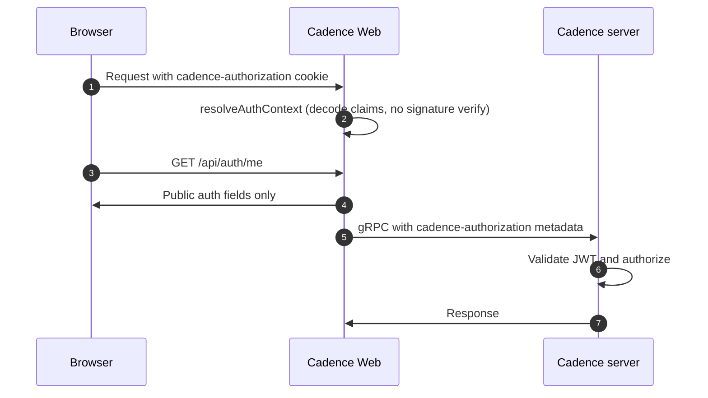

# Cadence Web authentication
This document explains how authorization works in the [Cadence](https://github.com/cadence-workflow/cadence) backend, how Cadence Web participates in that model, and how operators and developers should configure and use web auth.

---

## 1. Cadence backend authorization (brief)

The Cadence server ([cadence-workflow/cadence](https://github.com/cadence-workflow/cadence)) is the **source of truth** for who may call which APIs and what they may do on each domain. The Web UI does not replace that enforcement; it forwards credentials so the server can validate and authorize every gRPC request.

**JWT-based access.** When JWT authorization is enabled on the cluster, the server validates incoming tokens (signature, expiry, and claim shape per deployment config—often via an OAuth authorizer with a public key or JWKS). Typical claims include a subject (`sub`), optional display name (`name`), optional **group memberships** (`groups` as a string), and an optional **`admin`** flag. An admin claim is usually treated as a bypass for domain-level group checks.

**Domain-level rules.** Domains can carry metadata such as **read** and **write** group lists (for example `READ_GROUPS` / `WRITE_GROUPS`—exact names depend on your Cadence version and config). The server compares the caller’s groups (and admin flag) against that metadata to decide read vs write access for that domain.

**Clients and metadata.** gRPC clients are expected to send the credential the server is configured to accept. Cadence Web sends the raw JWT in gRPC metadata under the key **`cadence-authorization`** so the backend can validate and apply policy the same way as other tooling.

For server-side configuration (keys, authorizer settings, TTLs), use  the [Cadence GitHub repository](https://github.com/cadence-workflow/cadence) (including discussions and release notes for JWT/OAuth authorization).

---

## 2. How auth is implemented in Cadence Web

Cadence Web does **not** implement a full identity provider and does **not** verify JWT signatures. It **decodes** the JWT payload for UX and routing decisions; the Cadence server **validates** the token and enforces authorization.

**Strategy switch.** `CADENCE_WEB_AUTH_STRATEGY` is resolved at server start (`disabled` or `jwt`). Invalid or missing values behave as `disabled`.

| Strategy | Behavior |
| -------- | -------- |
| `disabled` (default) | No login required. No token is read from the cookie or sent to Cadence. Domain/action resolvers treat the user as having full access for UI purposes. |
| `jwt` | Auth is on: a JWT in the **`cadence-authorization`** HttpOnly cookie is decoded; if valid and not expired, it is attached to gRPC calls. |

**Cookie and token handling.** The cookie name is `cadence-authorization`. Server-side code (`resolveAuthContext`) reads the cookie, base64-decodes the JWT payload, and validates the shape with a small schema (for example `sub` or `name` required; optional `admin`, `groups`, `exp`). Expired or malformed tokens are dropped. The **raw JWT** stays on the server in the private auth context; the client only sees **public** fields via `GET /api/auth/me` (for example `authEnabled`, `groups`, `isAdmin`, `userName`, `id`, `auth.isValidToken`, `auth.expiresAtMs`—never the token string).

**Backend calls.** When strategy is `jwt` and a valid token is present, `getGrpcMetadataFromAuth` adds `cadence-authorization: <JWT>` to gRPC metadata so Cadence can authorize the request.

**UI and dynamic config.** `DOMAIN_ACCESS` uses auth context plus domain metadata from the server to compute per-domain access. `WORKFLOW_ACTIONS_ENABLED` combines that with other flags so buttons and actions match what the backend will allow. The nav bar and hooks such as `useUserInfo` / `useAuthLifecycle` drive login, logout, and expiry-aware behavior.

**API routes (server).**

- `GET /api/auth/me` — public auth snapshot; `Cache-Control: no-store`.
- `POST /api/auth/token` — body `{ "token": "<jwt>" }` (optional `Bearer ` prefix stripped); sets the HttpOnly cookie.
- `DELETE /api/auth/token` — clears the cookie.

---

## 3. How to use web auth

### Enable JWT mode

```bash
CADENCE_WEB_AUTH_STRATEGY=jwt
```

Restart Cadence Web after changing this value.

### Production: upstream gateway or SSO

Recommended pattern: your OAuth/OIDC proxy, ingress, or SSO gateway performs login, then sets the cookie on the **Cadence Web origin**:

```http
Set-Cookie: cadence-authorization=<JWT>; Path=/; HttpOnly; SameSite=Lax; Secure
```

Use a JWT whose claims match what your Cadence cluster is configured to validate and authorize. Users typically do not use the in-app “paste JWT” flow when a gateway sets the cookie automatically.

### Local development or ad hoc testing

1. Set `CADENCE_WEB_AUTH_STRATEGY=jwt`.
2. Obtain a JWT issued for your Cadence environment (same claims your server expects).
3. Either:
   - Use **Login with JWT** in the app (calls `POST /api/auth/token`), or  
   - `POST /api/auth/token` with `{ "token": "<JWT>" }` yourself.

Logout: use the UI logout control or `DELETE /api/auth/token`.

### Example JWT claims (illustrative)

```json
{
  "sub": "alice",
  "name": "Alice Example",
  "groups": "readers auditors",
  "admin": false,
  "iat": 1766080179,
  "exp": 1766083779
}
```

`groups` is a **string** (space- or comma-separated list in typical setups). Adjust claims to match your IdP and Cadence server configuration.

### Quick verification

1. `GET /api/auth/me` shows `authEnabled: true` and, after login, `auth.isValidToken: true`.
2. Domain pages and workflow actions reflect server permissions (not only frontend guesses).
3. Removing or expiring the token yields unauthenticated or denied behavior consistent with the backend.

---

### End-to-end flow (reference)


